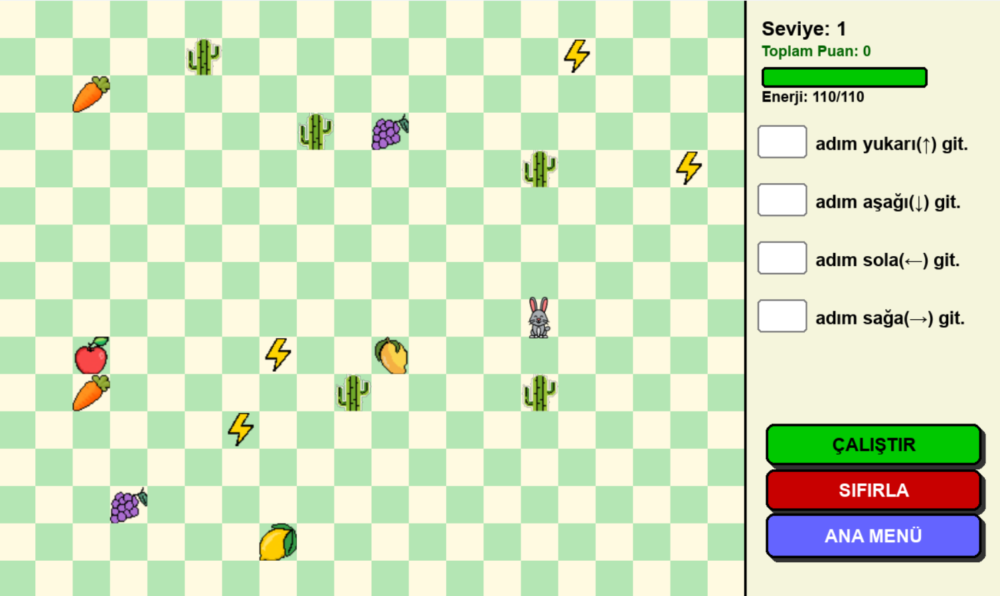
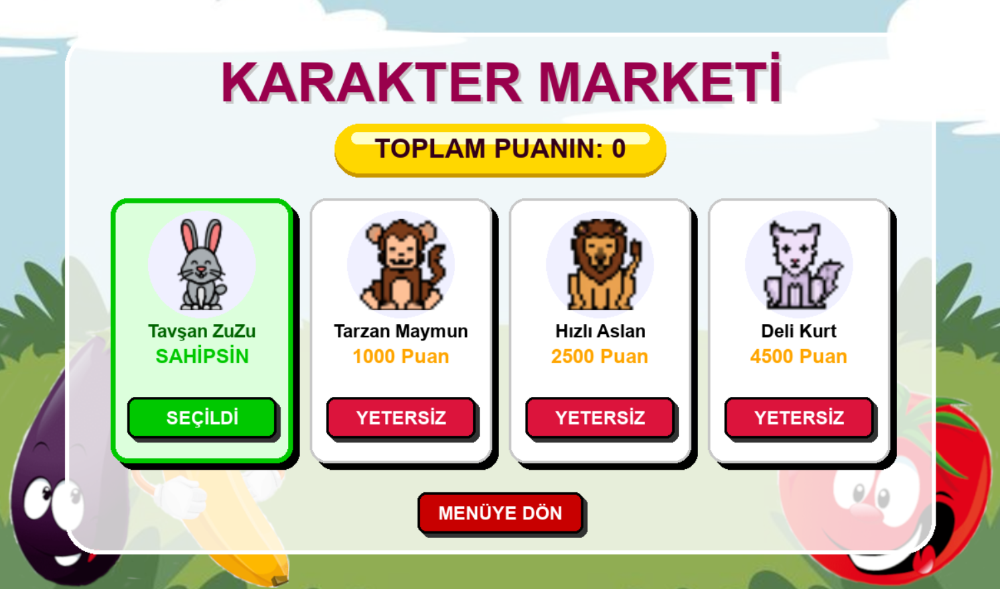

# 🐰 Tavşan ZuZu Görevde 

  

**İlkokul öğrencileri için algoritmik düşünme ve matematik becerilerini geliştirmeye yönelik Python & Pygame tabanlı eğitsel oyun.**

---

## Proje Hakkında 

Bu proje, öğrencilerin soyut kodlama mantığını (sıralı işlemler, döngüler, koşul yapıları) somutlaştırarak öğrenmelerini sağlamak amacıyla geliştirilmiştir. Oyuncular, karakteri hedefe ulaştırmak için komutları bir **kuyruk (queue)** yapısına ekler ve çalıştırır.

Proje, **Nesne Yönelimli Programlama (OOP)** prensipleri ve **Yapay Zeka Destekli Eşli Programlama (AI-Assisted Pair Programming)** metodolojisi kullanılarak geliştirilmiştir.

### ✨ Temel Özellikler 
* **Algoritmik Hareket Planlama:** Komutları sıraya dizme (FIFO) ve çalıştırma mantığı.
* **Dinamik Harita (Procedural Generation):** Her oyunda rastgele üretilen harita ve engel yerleşimi.
* **Oyun İçi Ekonomi:** Puan toplayarak yeni karakterler (Aslan, Maymun vb.) satın alma.
* **Matematik Entegrasyonu:** Dinamik olarak üretilen dört işlem soruları.
* **Fizik Motoru:** Farklı zemin türleri (Buz, Çamur) ile hız ve kayma etkileşimleri.

---

## Teknik Detaylar 

Bu proje, temiz kod ve modüler mimari prensiplerine sadık kalınarak hazırlanmıştır:

* **OOP Mimarisi:** `SpriteObj` temel sınıfından türetilen `Player`, `Enemy` ve `Obstacle` yapıları.
* **Veri Yapıları:**
    * **Queue (Kuyruk):** Hareket komutlarının işlenmesi için.
    * **Set (Küme):** Harita üretiminde çakışmaları (collision) O(1) sürede engellemek için.
    * **Dictionary (Sözlük):** Karakter ve tema verilerinin yönetimi için.
* **Polymorphism & Encapsulation:** Her nesnenin kendi `update()` metodunu özelleştirmesi.

---

## 🚀 Kurulum ve Çalıştırma 

Projeyi kendi bilgisayarınızda çalıştırmak için aşağıdaki adımları izleyin:

1.  **Repoyu klonlayın:**
    ```bash
    git clone [(https://github.com/melihatess/Tavsan-ZuZu-Gorevde-Proje)]
    cd Tavsan-ZuZu-Gorevde
    ```

2.  **Gerekli kütüphaneyi yükleyin:**
    ```bash
    pip install pygame
    ```

3.  **Oyunu başlatın:**
    ```bash
    python "main.py"
    ```

---

## Ekran Görüntüleri 

<p align="center">
  
  
</p>

---

## Geliştirici ve İletişim

* **Meliha Ateş** - *Tasarım, Kodlama ve Dokümantasyon* - melihates9407@gmail.com

## Lisans
Bu proje eğitim amaçlı geliştirilmiştir. Kaynak gösterilerek kullanılabilir.
